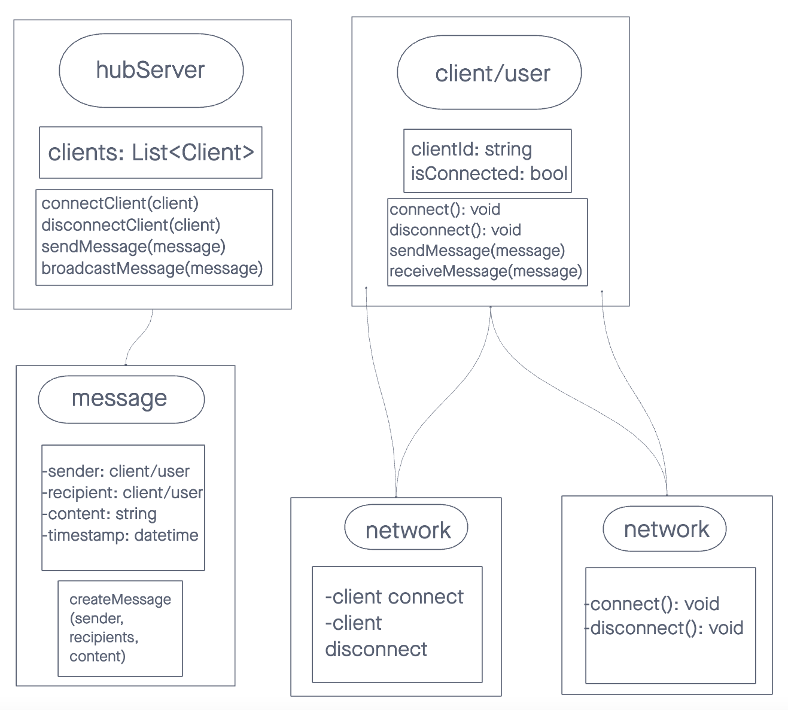

# Chismis

Chismis(Gossip in Tagalog) is a real-time messaging platform that allows users to engage in text-based conversations in a seamless and interactive manner.

## Live Deployment

## UML

## Installation

`npm install`

Create .env file, set PORT

`PORT=8080`

## Contributors

Sydney Pagalan
Joshua Shea